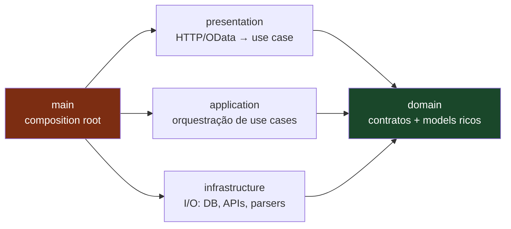

# CAP Clean Architecture — standards Numen DS

Documento canônico do padrão **Clean Architecture aplicado a projetos SAP CAP** na Numen DS. Esta é a referência transversal — vale para **todo** projeto CAP da casa, não para um único repositório. O scaffold do MCP [`mcps/cap-clean-arch/`](../../../mcps/cap-clean-arch/) materializa essa estrutura; este documento explica o **porquê** de cada decisão.

## Para quem é este documento

| Público | Como consumir |
|---------|---------------|
| **Agente de IA** (Cursor, Claude Code, Copilot) | Ponto de entrada citado em [`AGENTS.md`](../../../AGENTS.md) §4. Leitura obrigatória antes de criar/editar arquivos em projetos CAP. |
| **Desenvolvedor humano** | Material de estudo para entender o paradigma; cada camada tem seu próprio README com regras, exemplos e anti-padrões. |
| **Code reviewer** | Checklist implícito — qualquer divergência com este padrão é débito técnico que precisa de ADR/RFC para justificar. |

## Dependency rule (a regra mais importante)

A regra de dependência é **unidirecional** e segue o sentido externo → interno:



| Camada | Importa de | Importada por |
|--------|-----------|---------------|
| `domain/` | **Ninguém** (só `@sweet-monads/either`) | Todas as outras |
| `application/` | `domain/` | `main/` |
| `infrastructure/` | `domain/` | `main/` |
| `presentation/` | `domain/` (apenas `XxxUseCase.Params`) | `main/` |
| `main/` | Todas | **Ninguém** (entry point) |

> **Princípio orientador:** as camadas internas (`domain/`) não sabem que as externas existem. Inverter essa seta é violação de Clean Architecture e bloqueia review.

## As 5 camadas — visão de uma página

| Camada | O que vive aqui | Sufixo das classes | README |
|--------|-----------------|-------------------|--------|
| **`domain/`** | Contratos (`interface XxxRepository`, `XxxUseCase`, `XxxApi`, `XxxHydrator`), models ricos (`class XxxModel`), classes de erro (`AbstractError` + subclasses HTTP) | (interfaces) / `Model` / `Error` | [domain-layer/README.md](./domain-layer/README.md) |
| **`application/`** | Implementação de use cases (orquestração de regras de negócio) e services auxiliares | `UseCaseImpl`, `ServiceImpl` | [application-layer/README.md](./application-layer/README.md) |
| **`infrastructure/`** | Implementação de repositórios (CDS/HANA), adapters (S/4, REST, AWS, parsers), hydrators, UoW, translator i18n | `Impl`, `ApiImpl`, `HttpClient`, `Parser`, `UnitOfWork` | [infrastructure-layer/README.md](./infrastructure-layer/README.md) |
| **`presentation/`** | Controllers que traduzem `EventContext` do CAP em chamada tipada para use case e devolvem `BaseControllerResponse` | `Controller` | [presentation-layer/README.md](./presentation-layer/README.md) |
| **`main/`** | Composition root: factories (DI manual), routes (binding CAP), config (alias `@/`, env), scripts dev | (funções `makeXxx`) | [main-layer/README.md](./main-layer/README.md) |

## Estrutura canônica do projeto-alvo

```
src/
├── domain/                    → contratos + models (zero impl, zero framework)
│   ├── adapters/              → interface XxxApi, XxxParser, UnitOfWork
│   ├── errors/                → AbstractError + 6 subclasses HTTP
│   ├── hydrators/             → interface XxxHydrator (hydrate, com "y")
│   ├── models/                → class XxxModel + XxxProps
│   ├── repositories/          → interface XxxRepository + namespace
│   ├── services/              → interface XxxService (helper granular, sem I/O)
│   ├── use-cases/             → actions/, functions/, entity-events/
│   └── utils/                 → Translator, GetUser, GetEnvironment (contratos)
├── application/               → implementação de use cases e services
│   ├── use-cases/             → base/, actions/, functions/, entity-events/
│   └── services/              → base/ + <contexto>/
├── infrastructure/            → implementação de I/O
│   ├── adapters/              → external-api/, parsers/, unit-of-work/
│   ├── repositories/          → models/ + replication/
│   ├── hydrators/             → impl dos contratos de domain/hydrators
│   └── utils/                 → translator/, get-user.ts, get-environment.ts
├── presentation/              → controllers (HTTP/OData → use case)
│   └── controllers/           → base/, actions/, functions/, entity-events/
└── main/                      → composition root
    ├── assets/                → estáticos servidos em dev (opcional)
    ├── config/                → module-alias, environment
    ├── factories/             → DI manual de todas as camadas
    ├── routes/                → index.cds + index.ts (binding CAP)
    └── scripts/               → populate-local-db, replace-csn-source
```

## Glossário — conceitos-chave

| Termo | Definição operacional |
|-------|----------------------|
| **Model** | Classe rica com `XxxProps`, factory `static with(props)`, getters e métodos de validação/serialização. Vive em `domain/models/`. Sem I/O. |
| **Use case** | Orquestra um caso de uso de negócio. `interface XxxUseCase { execute(params): Promise<Either<AbstractError, T>> }` em `domain/`; impl em `application/use-cases/`. |
| **Service (domain)** | Mesmo shape de use case (`execute`), mas é helper interno entre use cases — não exposto em `index.cds`. Granularidade intermediária para evitar use case monolítico. |
| **Repository** | Contrato de persistência. `interface XxxRepository` em `domain/`; impl em `infrastructure/repositories/` usando `cds.ql.*` / `cds.run`. |
| **Adapter (API externa)** | Wrapper de sistema externo (S/4, REST, AWS). `interface XxxApi` em `domain/adapters/external-api/<sistema>/`; impl em `infrastructure/adapters/external-api/<sistema>/`. |
| **Adapter (técnico)** | Recurso de infra sem dialeto de negócio (HTTP client, UoW, telemetry). Nome próprio sem sufixo `Impl`. |
| **Hydrator** | Mutador de `request.query.SELECT.where` ou `request.body` antes do CDS executar. `hydrate()` (com "y"). |
| **Controller** | Tradutor `EventContext` ↔ `BaseControllerResponse`. Método público é sempre `handle`. Sem `req.reject`/`req.reply`. |
| **Factory** | Função `makeXxx(): InterfaceDomínio` que instancia a impl concreta e injeta dependências. Composition root. |
| **`Either<L, R>`** | Tipo canônico de retorno de use case. `left(error)` para falha, `right(value)` para sucesso. Importado de `@sweet-monads/either`. |
| **`AbstractError`** | Classe base de todo erro de domínio. 6 subclasses obrigatórias: `BadRequestError` (400), `UnauthorizedError` (401), `ForbiddenError` (403), `NotFoundError` (404), `ConflictError` (409), `ServerError` (500). |

## Regras de ouro globais (transversais às 5 camadas)

1. **Dependency rule é absoluta.** Setas só apontam para `domain/`. Qualquer import "para fora" do diagrama é violação de review.
2. **`Either<AbstractError, T>` é o contrato de retorno de use case.** A application produz `left()`/`right()`; a infrastructure **não** retorna `Either` — propaga exceção que o `BaseUseCaseImpl.handleError` captura.
3. **Models ricos, nunca anêmicos.** `class XxxModel` com `static with(props)` + getters + `validate()` + serialização. `type XxxModel = { ... }` é proibido.
4. **DI manual via constructor com `private readonly` tipado pela interface** — nunca pela impl concreta. Sem container de DI; toda composição vive em `main/factories/`.
5. **`tool-executor.ts` / `fs`** é privilégio exclusivo da camada `main/` (no projeto-alvo) ou do MCP (no scaffold). Nenhuma outra camada toca disco diretamente.
6. **`console.error` apenas — `stdout` reservado para CAP/JSON-RPC.** ESLint força `'no-console': ['error', { allow: ['error'] }]`.
7. **Sem framework no domain.** `@sap/cds`, `@models/*`, `@cds-models/*`, `@sap/textbundle`, `@sap/xsenv` e qualquer SDK externo são proibidos em `src/domain/`. Única dependência externa aceita: `@sweet-monads/either`.
8. **Imports NodeNext exigem extensão `.js` explícita** — mesmo em arquivos `.ts`. Ex.: `import type { PriceListRepository } from '@/domain/repositories/price-lists.js';`
9. **Sem barrel exports** dentro das camadas (exceção: `domain/errors/index.ts` e `*/entity-events/<entidade>/index.ts`).
10. **Tipos auxiliares vivem no namespace do próprio contrato** (`XxxRepository.DbRow`, `XxxUseCase.Params`). Sem arquivos `xxx.types.ts`, sem pasta `types/`.

## Pastas e padrões proibidos (anti-padrões observados)

Estes anti-padrões apareceram em projetos legados e são **proibidos** no padrão atual. Cada um tem seu substituto canônico documentado:

| Anti-padrão | Substituto canônico |
|-------------|--------------------|
| `domain/validators/` | Método `validate()` no `XxxModel` |
| `domain/middlewares/` | `application/` (pipeline) ou `infrastructure/` (adapter) |
| `domain/constants/` | `private readonly` na classe consumidora; enum no model |
| `domain/extractors/` ou `infrastructure/extractors/` | `domain/utils/get-*.ts` + `infrastructure/utils/get-*.ts` |
| `domain/formatters/` ou `infrastructure/formatters/` | `utils/` ou método do model |
| `domain/types/` ou `infrastructure/types/` | Namespace da interface |
| `infrastructure/services/` | `application/services/` |
| `XxxDto`, `XxxResponse`, `XxxRaw` | `XxxModel` + namespace do contrato |
| `static fromDbRow()`, `static forCreate()` como factories | Único factory é `static with(props)` (ou overloads `withFrom*`) |
| `Impl` no domain (ex.: `OciLineBuilderImpl` em `domain/services/`) | Implementação vai para `application/services/` |
| `hidrators/` / `hidrate()` (com "i") | `hydrators/` / `hydrate()` (com "y") |

Ver detalhamento em cada README de camada.

## Idioma

| Contexto | Idioma |
|----------|--------|
| Código TS dos projetos CAP (identifiers, throws, `console.error`, comentários de código) | EN |
| Conteúdo gerado para o dev (README do projeto-alvo, comentários nos `.cds`) | PT-BR |
| Esta documentação (`docs/standards/cap-clean-architecture/**/*.md`) | PT-BR |

## Ordem de leitura sugerida

### Para humanos novos no padrão

1. Este README (visão geral + dependency rule).
2. [domain-layer/README.md](./domain-layer/README.md) — entender o que **são** os contratos e models.
3. [application-layer/README.md](./application-layer/README.md) — como use cases consomem contratos.
4. [infrastructure-layer/README.md](./infrastructure-layer/README.md) — como I/O implementa contratos.
5. [presentation-layer/README.md](./presentation-layer/README.md) — entrada de requests.
6. [main-layer/README.md](./main-layer/README.md) — composição final.
7. [`docs/standards/code-style/typescript-syntax.md`](../code-style/typescript-syntax.md) — convenções de sintaxe.

### Para agentes implementando uma feature

1. Este README (regras de ouro + dependency rule).
2. README da camada onde o arquivo será criado.
3. Documento específico da subpasta (ex.: `application-layer/use-cases/actions.md`).
4. Sintaxe TS: [`docs/standards/code-style/typescript-syntax.md`](../code-style/typescript-syntax.md).
5. Decision Log da feature ativa em `docs/specs/features/<feat>/spec.md`.

### Para code reviewers

1. Este README (dependency rule + anti-padrões proibidos).
2. README da camada do arquivo em review.
3. Seção "Tipagem e constantes" + "Naming" do README da camada.

## Documentos desta seção

- [**domain-layer/**](./domain-layer/README.md) — contratos, models ricos, errors, namespaces auxiliares
  - [models/](./domain-layer/models/README.md) — `class XxxModel`, factory `with(props)`, validação, serialização
  - [errors/](./domain-layer/errors/README.md) — `AbstractError` + 6 subclasses HTTP
  - [repositories/](./domain-layer/repositories/README.md) — `interface XxxRepository` + namespace
  - [use-cases/](./domain-layer/use-cases/README.md) — actions, functions, entity-events
  - [services/](./domain-layer/services/README.md) — `interface XxxService` (helper granular)
  - [adapters/](./domain-layer/adapters/README.md) — `interface XxxApi`, `XxxParser`, `UnitOfWork`
  - [hydrators/](./domain-layer/hydrators/README.md) — `interface XxxHydrator` (hydrate, com "y")
  - [utils/](./domain-layer/utils/README.md) — `Translator`, `GetUser`, `GetEnvironment`
  - [testing.md](./domain-layer/testing.md) — testes de domain (models + utils)
- [**application-layer/**](./application-layer/README.md) — implementação de use cases e services
  - [use-cases/base.md](./application-layer/use-cases/base.md) — `BaseUseCaseImpl` e `BaseServiceImpl`
  - [use-cases/actions.md](./application-layer/use-cases/actions.md) — use cases de actions CDS
  - [use-cases/functions.md](./application-layer/use-cases/functions.md) — use cases de functions CDS
  - [use-cases/entity-events.md](./application-layer/use-cases/entity-events.md) — hooks de entidade
  - [services.md](./application-layer/services.md) — services auxiliares e pipelines
- [**infrastructure-layer/**](./infrastructure-layer/README.md) — I/O concreto (DB, APIs, parsers)
  - [adapters/](./infrastructure-layer/adapters/README.md) — external APIs, parsers, UoW
    - [adapters/external-apis.md](./infrastructure-layer/adapters/external-apis.md)
    - [adapters/parsers.md](./infrastructure-layer/adapters/parsers.md)
    - [adapters/unit-of-work.md](./infrastructure-layer/adapters/unit-of-work.md)
  - [repositories/](./infrastructure-layer/repositories/README.md)
    - [repositories/conventions.md](./infrastructure-layer/repositories/conventions.md)
    - [repositories/replication.md](./infrastructure-layer/repositories/replication.md)
  - [hydrators/](./infrastructure-layer/hydrators/README.md) — impl dos contratos `Before*Hydrator`
  - [utils/](./infrastructure-layer/utils/README.md) — translator, get-user, get-environment
    - [utils/translator/](./infrastructure-layer/utils/translator/README.md)
    - [utils/translator/i18n.md](./infrastructure-layer/utils/translator/i18n.md)
    - [utils/get-user.md](./infrastructure-layer/utils/get-user.md)
    - [utils/get-environment.md](./infrastructure-layer/utils/get-environment.md)
  - [testing.md](./infrastructure-layer/testing.md) — `makeSut`, `BaseStub`, `scenarios-overview.md`
- [**presentation-layer/**](./presentation-layer/README.md) — controllers (CAP → use case)
  - [controllers/base.md](./presentation-layer/controllers/base.md) — `BaseController`, `BaseControllerResponse`
  - [controllers/actions.md](./presentation-layer/controllers/actions.md) — controllers de actions CDS
  - [controllers/functions.md](./presentation-layer/controllers/functions.md) — controllers de functions CDS
  - [controllers/entity-events.md](./presentation-layer/controllers/entity-events.md) — hooks de entidade
- [**main-layer/**](./main-layer/README.md) — composition root, factories, routes, scripts
  - [assets.md](./main-layer/assets.md) — estáticos em dev
  - [config.md](./main-layer/config.md) — `module-alias.ts` e `environment.ts`
  - [factories/](./main-layer/factories/README.md) — DI manual
    - [factories/adapters.md](./main-layer/factories/adapters.md)
    - [factories/controllers.md](./main-layer/factories/controllers.md)
    - [factories/repositories.md](./main-layer/factories/repositories.md)
    - [factories/services.md](./main-layer/factories/services.md)
    - [factories/use-cases.md](./main-layer/factories/use-cases.md)
    - [factories/utils.md](./main-layer/factories/utils.md)
  - [routes.md](./main-layer/routes.md) — `index.cds` + `index.ts`
  - [scripts.md](./main-layer/scripts.md) — `populate-local-db`, `replace-csn-source`

## Referências cruzadas

- [`AGENTS.md`](../../../AGENTS.md) — porta de entrada do agente no monorepo
- [`README.md`](../../../README.md) — porta de entrada humana no monorepo
- [`docs/standards/code-style/typescript-syntax.md`](../code-style/typescript-syntax.md) — sintaxe TS (helpers vs API pública)
- [`mcps/cap-clean-arch/`](../../../mcps/cap-clean-arch/) — MCP que materializa este padrão
- [`docs/researches/cap-clean-arch/`](../../researches/cap-clean-arch/) — pesquisa-base que originou estes standards
- [`docs/specs/project/STATE.md`](../../specs/project/STATE.md) — Decision Log do projeto

## Como contribuir com este padrão

Mudanças neste padrão **não são feitas em PR direto**. O fluxo é:

1. **Discussão aberta** → criar RFC em `docs/rfc/` (skill `create-rfc`).
2. **Decisão fechada** → registrar ADR (skill `create-adr`); o ADR vira entrada no Decision Log do projeto em `docs/specs/project/STATE.md`.
3. **Implementação** → atualizar o(s) README(s) da(s) camada(s) afetada(s) + atualizar generators do MCP `cap-clean-arch` no mesmo PR (testes vivos).
4. **Drift check** → conferir consistência entre standards, generators e specs de feature ativas.

Itens removidos do escopo do padrão **não devem ser ressuscitados** sem novo ADR justificando a reversão.
