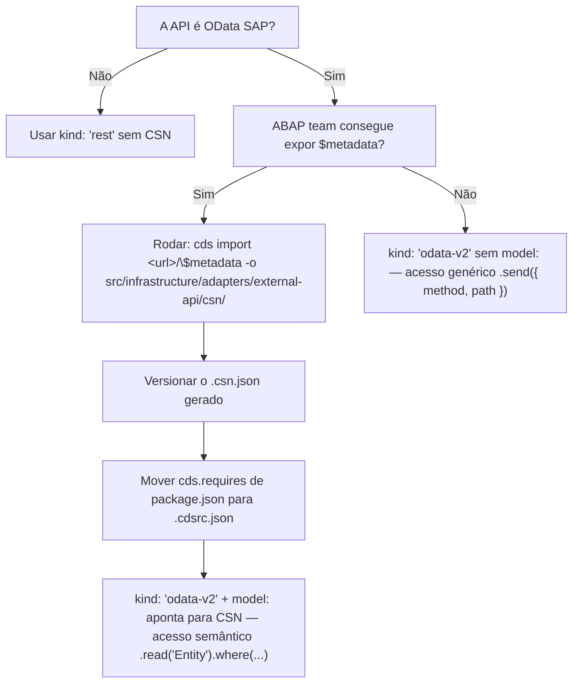

# Adapters de APIs externas

Adapters de APIs externas encapsulam toda comunicação com sistemas fora da aplicação: OData SAP S4, serviços REST, SDKs de cloud (AWS, GCP). Cada domínio de API vive em `adapters/external-api/<dominio>/` com uma implementação real (`*ApiImpl`) e uma fake (`Fake*ApiImpl`).

## Três cenários de integração

### 1. OData SAP S4 com `$metadata` disponível

O cenário ideal. `cds import` gera um `.csn.json` versionado; o `cds.requires` declara `kind: 'odata-v2'` + `model:` apontando para o CSN. Acesso semântico via `.read('Entity').where(...)`.

### 2. OData/REST sem `$metadata`

Sem CSN. Declare `kind: 'odata-v2'` ou `'rest'` sem `model:`. Acesso genérico via `.send({ method, path, data })`.

### 3. SDKs próprios (AWS, GCP, outros)

Instanciar o SDK diretamente no constructor. Credentials via `process.env` ou `xsenv`. Sem `cds.requires`.

## Estrutura de pasta canônica

```
src/infrastructure/adapters/external-api/
├── csn/
│   └── COMPANY_API.csn.json            → gerado por cds import
├── http/
│   └── sap-cloud-sdk-http-client.ts    → SapCloudSdkHttpClient (genérico)
├── company/
│   ├── company-api.ts                  → CompanyApiImpl (real)
│   └── fake-company-api.ts             → FakeCompanyApiImpl (fixture)
└── carrier/
    ├── carrier-api.ts                  → CarrierApiImpl
    └── fake-carrier-api.ts             → FakeCarrierApiImpl
```

## Wiring: `cds.requires` em `.cdsrc.json`

`cds.requires` fica **sempre** em `.cdsrc.json`, **nunca** em `package.json`. O comando `cds import` adiciona em `package.json` por default — mover imediatamente após rodar o comando.

```json
{
    "cds": {
        "requires": {
            "COMPANY_API": {
                "kind": "odata-v2",
                "model": "src/infrastructure/adapters/external-api/csn/COMPANY_API",
                "[development]": { "credentials": { "url": "http://localhost:3999" } },
                "[production]": { "credentials": { "destination": "S4DEST_PROD", "path": "/sap/opu/odata/sap/ZPP_C_GPEMPRESA_CDS_CDS" } }
            },
            "CARRIER_API": {
                "kind": "rest",
                "[development]": { "credentials": { "url": "http://localhost:3999" } },
                "[production]": { "credentials": { "destination": "CARRIER_DEST" } }
            }
        }
    }
}
```

### Tabela de `kind` por tipo de API

| Tipo de API | `kind` | Observação |
|---|---|---|
| OData v2 SAP | `odata-v2` | Padrão S4; suporta `model:` |
| OData v4 SAP | `odata-v4` ou `odata` | `odata` é alias de v4 |
| REST/JSON genérico | `rest` | Sem modelo CDS |
| HANA direto | `hana` | Raramente necessário em CAP |

## Few-shot 1 — `CompanyApiImpl` (OData com CSN, lazy connect)

```typescript
// src/infrastructure/adapters/external-api/company/company-api.ts
import cds, { Service } from '@sap/cds';

import { CompanyApi } from '@/domain/adapters/external-api/company.js';
import { CompanyModel, CompanyProps } from '@/domain/models/s4/company.js';

export class CompanyApiImpl implements CompanyApi {
    private api: Service;
    private readonly API_NAME = 'COMPANY_API';
    private readonly API_ENTITY = 'ZPP_C_GPEMPRESA_CDS';

    private async getApiInstance(): Promise<Service> {
        if (!this.api) {
            this.api = await cds.connect.to(this.API_NAME);
        }
        return this.api;
    }

    public async findByCostCenters(params: CompanyApi.FindByCostCentersParams): Promise<CompanyApi.FindByCostCentersResult> {
        if (params.costCenters.length === 0) {
            return [];
        }
        const api = await this.getApiInstance();
        const result: CompanyProps[] = await api
            .read(this.API_ENTITY)
            .where({ CostCenter: { in: params.costCenters } })
            .limit(500);
        return result.map((company) => CompanyModel.with(company));
    }
}
```

O `cds.connect.to` é lazy: a conexão é estabelecida na primeira chamada e reutilizada nas seguintes. O nome `'COMPANY_API'` deve bater com a chave declarada em `.cdsrc.json`.

## Few-shot 2 — `FakeCompanyApiImpl` (fixture in-memory)

```typescript
// src/infrastructure/adapters/external-api/company/fake-company-api.ts
import { CompanyApi } from '@/domain/adapters/external-api/company.js';
import { CompanyModel, CompanyProps } from '@/domain/models/s4/company.js';

export class FakeCompanyApiImpl implements CompanyApi {
    private readonly FAKE_COMPANIES: CompanyProps[] = [
        { CostCenter: 'CC001', CompanyCode: '1000', CompanyName: 'ACME SP' },
        { CostCenter: 'CC002', CompanyCode: '1000', CompanyName: 'ACME RJ' }
    ];

    public async findByCostCenters(params: CompanyApi.FindByCostCentersParams): Promise<CompanyApi.FindByCostCentersResult> {
        const filtered = this.FAKE_COMPANIES.filter((c) => params.costCenters.includes(c.CostCenter));
        return filtered.map((raw) => CompanyModel.with(raw));
    }
}
```

A fixture vive como `private readonly` da classe — alinhada ao padrão de constantes da application layer (`docs/standards/cap-clean-architecture/application-layer/README.md` regra 6). Sem `const` em module-level. Sem estado mutável entre chamadas.

## Few-shot 3 — `SapCloudSdkHttpClient` (adapter HTTP genérico)

Vive em `adapters/external-api/http/` — não dentro de um domínio específico, pois é compartilhado por múltiplos adapters de domínio.

```typescript
// src/infrastructure/adapters/external-api/http/sap-cloud-sdk-http-client.ts
import { executeHttpRequest, HttpDestinationOrFetchOptions } from '@sap-cloud-sdk/http-client';
import { buildHeadersForDestination } from '@sap-cloud-sdk/connectivity';

import type { SapHttpClient } from '@/domain/adapters/external-api/http/sap-http-client.js';
import { ServerError } from '@/domain/errors/server-error.js';

export class SapCloudSdkHttpClient implements SapHttpClient {
    private readonly CSRF_FETCH_HEADER = 'Fetch';
    private readonly SAP_ERROR_PATH = ['response', 'data', 'error', 'message', 'value'];

    public async post<T>(params: SapHttpClient.PostParams): Promise<T> {
        const destination: HttpDestinationOrFetchOptions = {
            destinationName: params.destinationName,
            url: params.url
        };
        try {
            const response = await executeHttpRequest(destination, {
                method: 'post',
                url: params.path,
                data: params.data,
                headers: params.headers
            });
            return response.data as T;
        } catch (error: unknown) {
            throw this.toServerError(error);
        }
    }

    public async fetchCsrfToken(params: SapHttpClient.FetchCsrfParams): Promise<SapHttpClient.FetchCsrfResult> {
        const destination: HttpDestinationOrFetchOptions = {
            destinationName: params.destinationName,
            url: params.url
        };
        const headers = await buildHeadersForDestination(destination);
        const response = await executeHttpRequest(destination, {
            method: 'get',
            url: params.path,
            headers: { ...headers, 'x-csrf-token': this.CSRF_FETCH_HEADER }
        });
        const token = response.headers['x-csrf-token'] as string;
        const cookies = response.headers['set-cookie']?.join('; ') ?? '';
        return { token, cookies };
    }

    private toServerError(error: unknown): ServerError {
        const stack = error instanceof Error ? error.stack ?? '' : String(error);
        const sapMessage = this.extractSapMessage(error);
        return new ServerError(stack, sapMessage);
    }

    private extractSapMessage(error: unknown): string {
        const message = this.readNestedString(error, this.SAP_ERROR_PATH);
        if (message) {
            return message;
        }
        return error instanceof Error ? error.message : String(error);
    }

    private readNestedString(source: unknown, path: readonly string[]): string | undefined {
        let current: unknown = source;
        for (const key of path) {
            if (current && typeof current === 'object' && key in current) {
                current = (current as Record<string, unknown>)[key];
                continue;
            }
            return undefined;
        }
        return typeof current === 'string' ? current : undefined;
    }
}
```

O enriquecimento de erro extrai `error.response.data.error.message.value` — estrutura padrão de resposta de erro OData SAP — sem declarar tipo inline para o shape do erro. O caminho de extração é uma constante `private readonly` da classe (`SAP_ERROR_PATH`); o `readNestedString` faz navegação segura via `key in current` em runtime. Quando a mensagem SAP é encontrada, é preservada no `ServerError`; caso contrário, cai no `error.message` padrão.

## Few-shot 4 — `SapStockBalanceApiImpl` (adapter de domínio com DI de `SapHttpClient`)

```typescript
// src/infrastructure/adapters/external-api/stock-balance/sap-stock-balance-api.ts
import type { SapHttpClient } from '@/domain/adapters/external-api/http/sap-http-client.js';
import type { StockBalanceApi } from '@/domain/adapters/external-api/stock-balance.js';
import { StockBalanceModel, StockBalanceProps } from '@/domain/models/s4/stock-balance.js';
import { ServerError } from '@/domain/errors/server-error.js';

export class SapStockBalanceApiImpl implements StockBalanceApi {
    private readonly DESTINATION_NAME = 'S4DEST_PROD';
    private readonly SERVICE_URL = 'https://s4host.example.com';
    private readonly SERVICE_PATH = '/sap/opu/odata/sap/ZMM_STOCK_BALANCE_SRV/StockBalanceSet';
    private readonly FETCH_ERROR_MESSAGE = 'Erro ao consultar estoque no S4';

    constructor(private readonly httpClient: SapHttpClient) {}

    public async findByMaterials(params: StockBalanceApi.FindByMaterialsParams): Promise<StockBalanceApi.FindByMaterialsResult> {
        const filter = params.materials.map((m) => `Material eq '${m}'`).join(' or ');
        try {
            const response = await this.httpClient.post<StockBalanceApi.RawResponse>({
                destinationName: this.DESTINATION_NAME,
                url: this.SERVICE_URL,
                path: `${this.SERVICE_PATH}?$filter=${encodeURIComponent(filter)}&$format=json`,
                data: undefined,
                headers: { Accept: 'application/json' }
            });
            return this.mapToModels(response.d.results);
        } catch (error: unknown) {
            if (error instanceof ServerError) {
                throw error;
            }
            throw new ServerError(
                error instanceof Error ? error.stack ?? '' : String(error),
                this.FETCH_ERROR_MESSAGE
            );
        }
    }

    private mapToModels(rawList: StockBalanceProps[]): StockBalanceModel[] {
        return rawList.map((raw) => StockBalanceModel.with(raw));
    }
}
```

Pontos a observar:
- `DESTINATION_NAME`, `SERVICE_URL`, `SERVICE_PATH` e `FETCH_ERROR_MESSAGE` são `private readonly` da classe — mesmo padrão de constantes da application layer ([`application-layer/README.md`](../../application-layer/README.md) regra 6). Sem literais soltos no corpo dos métodos nem em module-level.
- `SapHttpClient` é injetado via constructor tipado pela interface do domínio.
- `instanceof ServerError` re-lança sem wrap; qualquer outro erro é envolvido com mensagem contextualizada.
- Tipos do raw OData S4 vêm **exclusivamente do domain**: `StockBalanceProps` (shape de um registro) em `domain/models/s4/stock-balance.ts`; `StockBalanceApi.RawResponse` (envelope completo `{ d: { results: [...] } }`) no namespace do adapter em `domain/adapters/external-api/stock-balance.ts`. Nenhum `interface`/`type` declarado dentro deste arquivo.
- Transformação de tipos brutos (ex.: `parseFloat` em campos string) acontece dentro de `StockBalanceModel.with()` — o adapter apenas delega.

## Few-shot 5 — Factory com selector real/fake

O selector fica **na factory**, nunca dentro do adapter. Shape canônico:

```typescript
// src/main/factories/adapters/external-api/company.ts
import type { CompanyApi } from '@/domain/adapters/external-api/company.js';
import { CompanyApiImpl } from '@/infrastructure/adapters/external-api/company/company-api.js';
import { FakeCompanyApiImpl } from '@/infrastructure/adapters/external-api/company/fake-company-api.js';

export const makeCompanyApi = (): CompanyApi =>
    process.env.NODE_ENV !== 'production'
        ? new FakeCompanyApiImpl()
        : new CompanyApiImpl();
```

Quando o adapter real requer DI (ex.: `SapHttpClient`), a factory o compõe:

```typescript
// src/main/factories/adapters/external-api/stock-balance.ts
import type { StockBalanceApi } from '@/domain/adapters/external-api/stock-balance.js';
import { SapStockBalanceApiImpl } from '@/infrastructure/adapters/external-api/stock-balance/sap-stock-balance-api.js';
import { FakeSapStockBalanceApiImpl } from '@/infrastructure/adapters/external-api/stock-balance/fake-sap-stock-balance-api.js';
import { makeSapHttpClient } from '@/main/factories/adapters/external-api/http/sap-http-client.js';

export const makeStockBalanceApi = (): StockBalanceApi =>
    process.env.NODE_ENV !== 'production'
        ? new FakeSapStockBalanceApiImpl()
        : new SapStockBalanceApiImpl(makeSapHttpClient());
```

## SDKs próprios (AWS, GCP)

Quando o serviço externo não é SAP e não há `cds.connect.to`, instanciar o SDK diretamente no constructor. Sem `cds.requires`.

```typescript
// src/infrastructure/adapters/external-api/object-store/s3-api.ts
import { S3Client, ListObjectsV2Command } from '@aws-sdk/client-s3';

import { ObjectStoreApi } from '@/domain/adapters/external-api/object-store.js';

export class S3ApiImpl implements ObjectStoreApi {
    private readonly client: S3Client;

    constructor() {
        this.client = new S3Client({
            region: process.env.AWS_REGION,
            credentials: {
                accessKeyId: process.env.AWS_ACCESS_KEY_ID!,
                secretAccessKey: process.env.AWS_SECRET_ACCESS_KEY!
            }
        });
    }

    public async listObjects(params: ObjectStoreApi.ListObjectsParams): Promise<string[]> {
        const command = new ListObjectsV2Command({ Bucket: params.bucket, Prefix: params.prefix });
        const result = await this.client.send(command);
        return result.Contents?.map((o) => o.Key!) ?? [];
    }
}
```

Credentials via `process.env` é aceitável para AWS. Quando houver binding BTP equivalente (ex.: Object Store Service), abstrair via `xsenv` no `get-environment.ts` e injetar os credentials via constructor.

## Tipagem e constantes

Aplicar as 3 regras globais da [seção "Tipagem e constantes" do README da infrastructure-layer](../README.md#tipagem-e-constantes) — sem DTOs, interfaces/tipagens exclusivamente do `domain/`, constantes como `private readonly` da classe.

Especificamente para adapters de APIs externas:

| Conceito | Onde fica | Exemplo |
|---|---|---|
| Shape de um registro raw da API externa | `domain/models/<sistema>/<entidade>.ts` exportando `XxxProps` | `CompanyProps`, `StockBalanceProps` |
| Envelope completo da response (`{ d: { results: [...] } }`) | Namespace da interface do adapter em `domain/adapters/external-api/<dominio>.ts` | `StockBalanceApi.RawResponse` |
| `Params` e `Result` dos métodos do adapter | Namespace da interface do adapter em `domain/adapters/external-api/<dominio>.ts` | `StockBalanceApi.FindByMaterialsParams` |
| Transformação raw → domínio (ex.: `parseFloat` de campo string) | Método `XxxModel.with()` no `domain/models/<sistema>/<entidade>.ts` | `StockBalanceModel.with(raw)` |

Os few-shots `SapCloudSdkHttpClient`, `SapStockBalanceApiImpl` e `FakeCompanyApiImpl` desta página seguem rigorosamente esse padrão — use-os como referência ao criar novos adapters.

## Quando usar `cds import`



Após `cds import`, o comando escreve a entry de `cds.requires` em `package.json`. **Mover imediatamente** para `.cdsrc.json` antes do primeiro commit.

## Anti-padrões

| # | Anti-padrão | Origem observada |
|---|---|---|
| 1 | Selector `NODE_ENV` dentro do adapter (facade `*AdapterImpl` + `ConcreteXxx` + `FakeXxx`) | Projetos Suzano |
| 2 | `kind: 'rest'` em dev para uma API OData em prod (environments com `kind` diferente) | Projetos Suzano |
| 3 | `cds.requires` em `package.json` em vez de `.cdsrc.json` | Default do `cds import` |
| 4 | Destination hardcoded em string literal espalhada em vários adapters (`'PortalMRO-ECC_Odata'`) | Projetos MRO |
| 5 | Bypass `if (NODE_ENV === 'dev') return right(undefined)` dentro do adapter | Projetos RVE |
| 6 | Sufixo `*Client` em vez de `*ApiImpl` para adapters de domínio | Legado MRO/RVE |
| 7 | `interface XxxDto` / `interface XxxResponse` dentro de arquivo da infrastructure | — |
| 8 | `type`/`interface` declarado em arquivo da infrastructure (mesmo que local) — todo tipo vem do domain | — |
| 9 | `const FOO = ...` em module-level dentro de arquivos da infrastructure (tem que ser `private readonly` na classe) | — |
| 10 | Mapeamento raw → domínio dentro do adapter (campo a campo) em vez de delegar para `XxxModel.with(raw)` | — |
